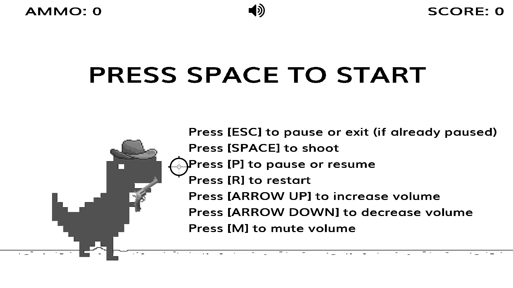

# Texas-T-Rex



## What is it? 

It's a game inspired by Google Chrome's dino, in which you are a T-Rex with a hat and a revolver that needs to shoot birds and cactus to keep running and survive.

It's written purely in C and uses SDL2.


## Installation

### Windows:

- Simply git clone the repo and run make. 

```bash
    git clone https://github.com/TheStef56/Texas-T-Rex
    cd Texas-T-Rex
    make
```

### Linux:

- Git clone recursively, because you will need to build SDL2 on your machine.

```bash
    git clone --recursive https://github.com/TheStef56/Texas-T-Rex
    cd Texas-T-Rex
    make
``` 

### Mac-OS:
- I didn't test it, but the build process should be the same of Linux.

## Usage

- Just run the resulting executable. It's static, but it needs the assets folder to run, so if you move it from its original folder, make sure to move also the assets.


## License

[MIT](https://choosealicense.com/licenses/mit/)